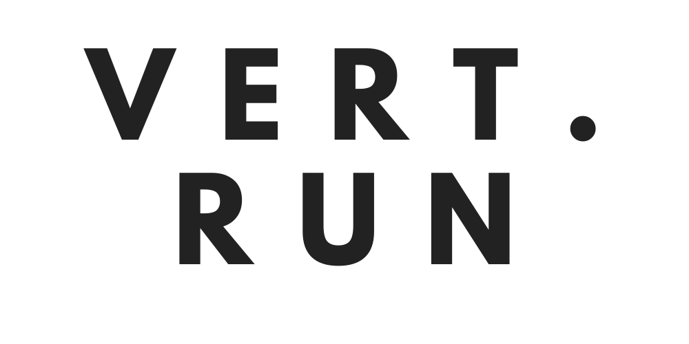

# Challenge Técnico Vert Run

El proyecto fue realizado utilizando React + Redux para el manejo de estados globales. </br>
Puedes inicializar el proyecto siguiendo los siguientes pasos:

```
git clone https://github.com/EricIllanes/vertRun-app.git
cd vertRun-app
npm install
npm run dev
```

